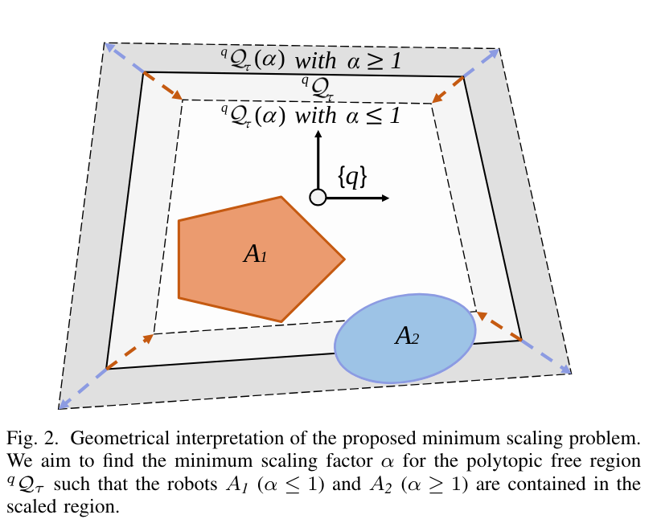

# Minimum Scaling Problem 
<p align ="center">

</p>
This is an official implementation for formulating and solving the minimum scaling SDP optimizaiton problem proposed in our paper:
[Collision-Free Trajectory Optimization in Cluttered Environments with Sums-of-Squares Programming](https://arxiv.org/abs/2404.05242).

Given:
- the current robot configuration $\boldsymbol{q}$.
- a polytopic free region $\mathcal{Q}$.
- the robot geometry $\mathcal{W}_B$ represented as a semialgebraic set (expressed with polynomial equalities and inequalities).

This repository show how we calculate the minimum scaling factor such that the robot is contained in the scaled free region; and how we extract the gradient of the Lagarangian with respect to robot configuration $\boldsymbol{q}$ at the primal-dual optimum. This information can be further integrated with gradient-based trajectory optimization solvers to provide us a guiding optimization direction for decreasing the value of $\alpha$, and thus, pushing the robot inward the free region to ensure safety. 


## Prerequisites
1. Installing matlab on your local machine, together with the [symbolic toolbox](https://ww2.mathworks.cn/products/symbolic.html).
2. clone the source code:
    ```
        git clone "https://github.com/lyl00/minimum_scaling_free_region.git" 
    ```
3. create and cd the third_party folder and then create a matlab folder to set up the dependencies:
    ```
    mkdir third_party
    cd third_party
    mkdir matlab
    cd matlab
    ```

    - install mosek properly, see [mosek matlab](https://docs.mosek.com/10.1/toolbox/install-interface.html), and make sure you get a valid license and pass the test.

    - install the bensolve toolbox for visualizing the polytope and convert between v-rep and h-rep, see [bensolve tool](http://tools.bensolve.org/)。


    - download the matlab code library of [modern robotics](https://github.com/NxRLab/ModernRobotics/tree/master/packages/MATLAB) for conducting some operation to SE(3), i.e., the mr folder. 

4. your final folder sturcture should look like the following:
    ```
    ├── gradient_expression.mat
    ├── README.md
    ├── scaling_sdp_example.mlx
    ├── third_party
    │   └── matlab
    │       ├── bt-1.3
    │       ├── mosek
    │       └── mr
    └── utils
        ├── calculate_gradients.m
        ├── coeffs_term.m
        ├── generate_coeffs_matrix.m
        ├── genpow.m
        ├── gen_sos_polynomial.m
        ├── mono_grevlex_fun.m
        ├── rep_poly_bTow.m
        ├── rotx.m
        ├── roty.m
        └── rotz.m
    ```
The [`gradient_expression.mat`](utils/calculate_gradients.m) is generated by running [`calculate_gradients.m`](utils/calculate_gradients.m), providing the analytical expression for calculating the required gradient.

The [`utils`](utils) folder provides some necessary
functions for constructing the proposed optimization problem.

[`scaling_sdp_example.mlx`](scaling_sdp_example.mlx) is an fully commented example live matlab script for 
##  Running the example

[`scaling_sdp_example.mlx`](scaling_sdp_example.mlx) is a fully commented live matlab script illustrating how to construct and solve the optimization problem, extract the primal-dual optimum, and calculate the gradient information.

You can run it section by section to clearly see each step. We also plot the free region, robot and scaled free region (using the calculated minimum scaling factor) to visualize the results.


## Authors

- [@Yulin Li](yline@connect.ust.hk)

Feel free to contact me if you have any questions regarding the implementation of the algorithm, we will keep updating this repository to provide implementation s of other parts of our [contributed paper](https://arxiv.org/abs/2404.05242).

